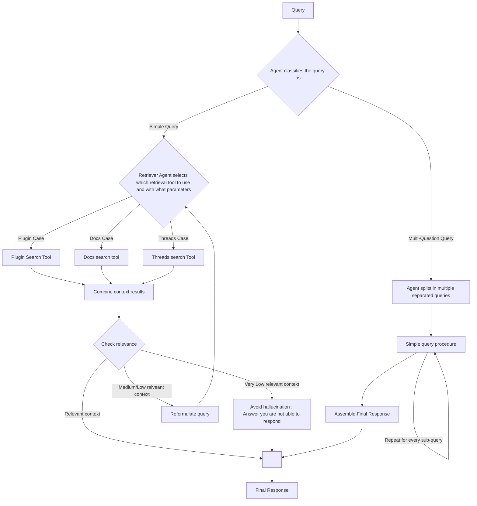

# Agent Query Flow Diagram

```mermaid
flowchart TD
    A[Query] --> B{Agent classifies the query as}

    B -->|Multi-Question Query| C2[Agent splits in multiple separated queries]
    C2 --> D2[Simple query procedure]
    D2 --> |Repeat for every sub-query| D2
    D2 --> E2[Assemble Final Response]
    
    B -->|Simple Query| H{Retriever Agent selects which retrieval tool to use and with what parameters}
    H --> |Plugin Case| J1[Plugin Search Tool]
    H --> |Docs Case| I2[Docs search tool]
    H --> |Threads Case| J3[Threads search Tool]

    J1 --> J4[Combine context results]
    J4 --> J2{Check relevance}

    I2 --> J4

    J3 --> J4

    J2 --> |Relevant context| Z[.]
    J2 --> |Medium/Low relveant context| I3[Reformulate query]
    I3 --> H
    J2 --> |Very Low relevant context| Z1[Avoid hallucination ; Answer you are not able to respond]

    Z1 --> Z

    E2 --> Z

    Z --> Final[Final Response]
```
